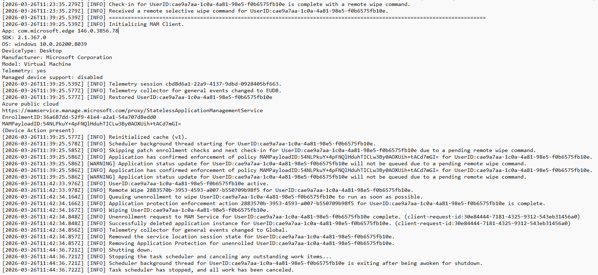

# Selective Wipe

How to remotely wipe **only corporate data** from a MAM-enrolled user's device — without touching their personal files.

> ⚠️ A selective wipe removes **org data protected by app protection policies** (e.g., work profile in Edge). It does **not** factory-reset the device or delete personal files.

> 📖 Reference: [How to wipe only corporate data from Intune-managed apps](https://learn.microsoft.com/en-us/intune/intune-service/apps/apps-selective-wipe)

---

## When to Use a Selective Wipe

- Employee leaves the company
- Device is lost or stolen
- User moves to a different role that no longer needs access
- Security incident on an unmanaged device
- User requests removal of work data from their personal device

---

## Steps to Perform a Selective Wipe

### Option 1: Wipe by Device (specific device for a user)

Use this when a user has multiple devices and you only want to wipe **one specific device**.

1. Sign in to the [Microsoft Intune admin center](https://intune.microsoft.com)
2. Navigate to **Apps → App selective wipe**
3. Click **Create wipe request**
4. In the *Create wipe request* pane, click **Select user** and choose the target user, then click **Select**
5. Click **Select the device**, choose the specific device, then click **Select**
6. Click **Create** to submit the wipe request

The service creates and tracks a **separate wipe request for each protected app** on the device.

### Option 2: Wipe by User (all devices at once)

Use this when you want to wipe org data from **all** of a user's devices at once. The user will receive wipe commands at every check-in from all devices.

1. Sign in to the [Microsoft Intune admin center](https://intune.microsoft.com)
2. Navigate to **Apps → App selective wipe**
3. Click **User-Level Wipe**
4. Click **Add** — the *Select user* pane appears
5. Choose the user whose app data you want to wipe, then click **Select**

> ⚠️ To re-enable a user after a user-level wipe, you must **remove them from the list**. Otherwise they will continue receiving wipe commands at every check-in.

---

## Monitor Your Wipe Requests

1. Navigate to **Apps → App selective wipe**
2. The pane shows your requests **grouped by user**
3. Because the system creates a separate wipe request for each protected app on the device, you may see **multiple requests per user**
4. The status indicates whether a wipe request is **pending**, **failed**, or **successful**
5. You can also see the **device name** and **device type** for each request

> Completed wipe requests remain in the report for **4 days** after completion. Pending requests remain for the sum of the *Offline grace period wipe data* value + 4 days (default: 94 days total).

 

---

## Delete a Wipe Request

### Delete a device wipe request

Pending wipe requests are displayed until you manually delete them:

1. On the **Apps → App selective wipe** pane
2. Right-click the wipe request you want to delete
3. Choose **Delete wipe request**
4. Confirm the deletion

### Delete a user wipe request

User-level wipes remain in the list until removed by an administrator:

1. On the **Apps → App selective wipe** pane, select **User-Level Wipe**
2. Right-click the user you want to remove
3. Choose **Delete**

---

## What Happens After a Selective Wipe

| What gets removed | What stays untouched |
|---|---|
| Org data in Edge work profile (cached pages, bookmarks, cookies) | Personal browsing data in Edge |
| Work account sign-in session | Personal Microsoft account |
| Cached corporate documents | Personal files on the device |
| Contacts synced from the app to the native address book | Personal contacts from other sources |
| App protection policy assignments for that device | The Edge browser itself (not uninstalled) |

---

## Important Notes

- **The user must open the app** for the wipe to occur. The wipe may take up to **30 minutes** after the request was made.
- Selective wipe **only affects MAM-managed data**. It does not perform a full device wipe.
- After a wipe, the user can re-enroll in MAM by signing back into Edge with their work account (if their account is still active and policies still target them).
- For users who have left the company, combine the selective wipe with **disabling their Entra ID account** to prevent re-enrollment.
- Deployment of **App Protection Policies is required** to enable app selective wipe.
